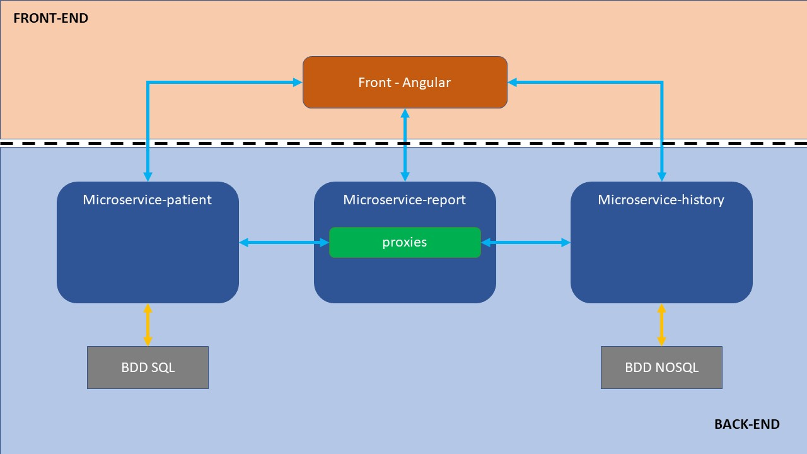
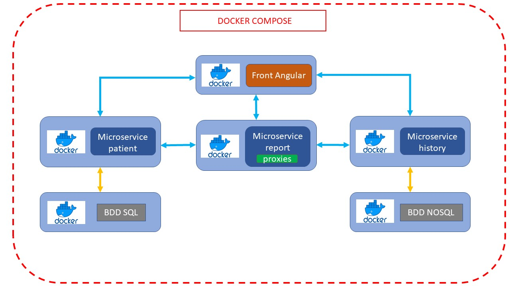
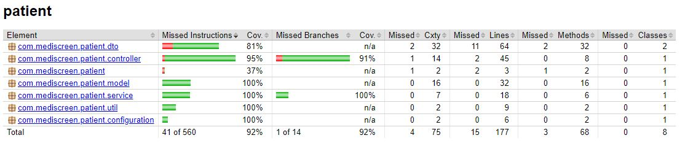
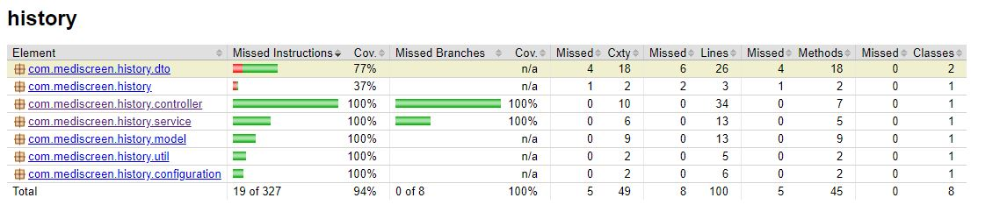
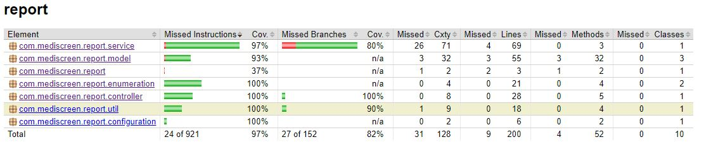

# Mediscreen app

Mediscreen app is an application used in the medical environment. It allows in particular to help detect the probability in a patient of developing diabetes.

### Global architecture

### Docker deployment

### Getting Started

These instructions will get you a copy of the project up and running on your local machine for development and testing purposes. See deployment for notes on how to deploy the project on a live system.

### Prerequisites

What things you need to install the software and how to install them

1. Framework: Spring Boot v2.7.1
2. Java 1.8
3. Maven : 3.8.2
4. BootStrap : 5.1.3
5. Angular CLI : 13.2.5
6. MySql : 8.0.27
7. Mongo
8. Docker

### Installing

A step by step series of examples that tell you how to get a development env running:

1.Install Java:

https://docs.oracle.com/javase/8/docs/technotes/guides/install/install_overview.html

2.Install Maven:

https://maven.apache.org/install.html

3.Install Docker:

https://docs.docker.com/

### Default configuration

Front:

Mediscreen-front  URL = http://localhost

Microservices:

Mediscreen-patient URL = http://localhost:8081

Mediscreen-history URL = http://localhost:8082

Mediscreen-report URL = http://localhost:8080

Port can be change in application.properties, in each app.

### Running App

Import last version of the code into an IDE, open a Terminal and execute the below command.

`docker-compose up`

### Running test

`.\mvn_test.bat`

### Generate maven site

`.\mvn_site.bat`

### Test report

